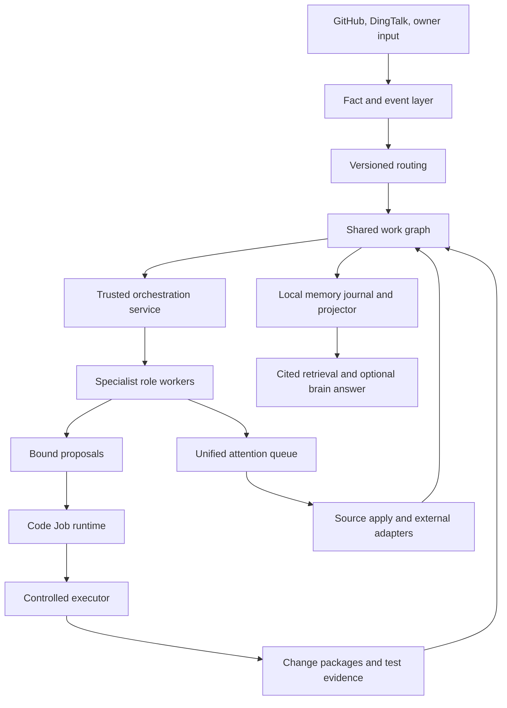
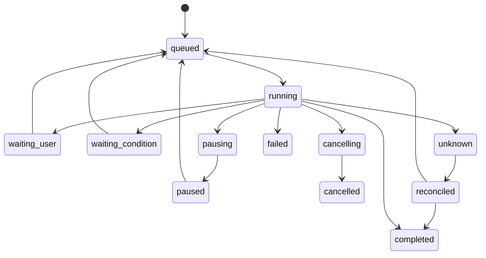
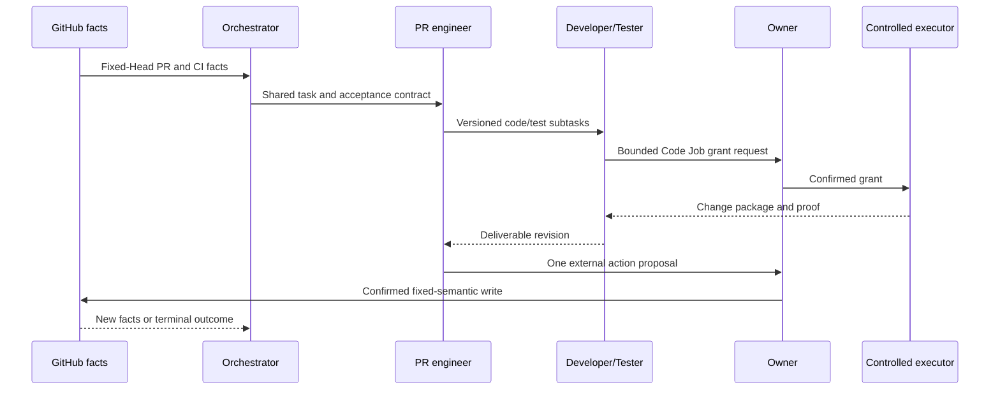
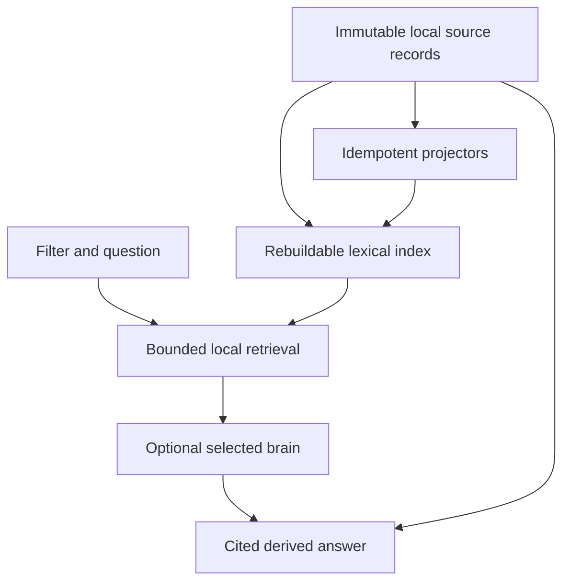

# Complete Local Command Center - Plan

## Goal Capsule

- **Objective:** Finish MyDashboard as a local-first, open-source engineering command center whose proactive roles share durable work, can use interchangeable local or remote brains, and can complete a safe PR workflow from discovery through verified delivery and searchable memory.
- **Authority:** Current user instructions override this plan; the Product Contract controls product behavior; Key Technical Decisions control implementation boundaries; each U-ID controls only its declared unit.
- **Execution profile:** Continue on the existing feature branch, preserve current local state and compatibility, verify each unit before the next, and create local commits only.
- **Stop conditions:** Stop before any unapproved external write, remote data egress, privilege expansion, destructive source-repository change, or GitHub push/merge while the final GitHub account remains unconfirmed.
- **Tail ownership:** Local verification, review, documentation, and commits are in scope; publishing to GitHub is not.

---

## Product Contract

### Summary

MyDashboard is the owner's local engineering headquarters rather than a passive board. A trusted controller maintains shared work and safety boundaries while specialized AI employees observe, judge, consult, collaborate, execute bounded tools, and follow work through to a verified outcome. Ollama is the default local brain, not a hard dependency or the only brain. Durable local records remain authoritative and searchable even when every model provider is unavailable.

### Problem Frame

Stages 1–6 established routing, employees, structured brains, local memory, work ledgers, confirmations, GitHub Review proposals, and a controlled executor. The remaining system is fragmented: the Code Job bridge is incomplete, the orchestrator is mostly another single-item role, specialist roles do not share versioned deliverables, memory search has no cited AI answer layer, configuration is mostly static, and the PR engineer cannot yet iterate through code, CI, conflicts, and delivery. A complete product must join those pieces without weakening the existing fail-closed boundaries.

### Actors

- A1. Owner — configures the system, answers consultations, grants or revokes authority, and confirms every externally visible or irreversible action.
- A2. Orchestrator employee — observes global work, creates and coordinates a shared task graph, monitors dependencies and blockers, and escalates decisions without acquiring execution authority.
- A3. Specialist employees — requirements analyst, PR engineer, developer, tester, and later roles that produce versioned deliverables under explicit permissions.
- A4. Brain providers — local Ollama or explicitly configured third-party providers that receive only data classes authorized for the selected role and task.
- A5. Trusted executors — local services that validate revisions, grants, tools, workspaces, GitHub targets, and confirmation receipts before producing side effects.
- A6. External systems — GitHub, CI, DingTalk, and future integrations whose writes never follow directly from a model response.

### Requirements

**Product identity and trust**

- R1. The product remains open-source, local-first, single-user, and bound to loopback by default; cloud hosting and multi-user tenancy are outside the initial product identity.
- R2. Every employee has independent mission, permissions, schedule, pause state, brain configuration, and durable activity, while all employees collaborate through shared versioned work rather than isolated text output.
- R3. Ollama remains the default local option for routine patrol, relevance judgment, summarization, and low-risk routing. Real PR requirements, conflict resolution, code changes, Review, and CI diagnosis route to a separately configured high-capability brain and never silently fall back to the small local model; any OpenAI-compatible third-party brain can be assigned per role or task only after explicit data-class authorization.
- R4. Consultations and approval-required actions enter one durable queue and appear one at a time; bulk approval is not supported.
- R5. GitHub account selection, credentials, remote-data authorization, permission elevation, and externally visible or irreversible actions remain human-only decisions.
- R6. Existing employee state, PR jobs, workflow history, confirmations, memory, and compatibility APIs survive upgrades and recovery.
- R7. The runtime does not depend on or enable `claude-mem`; ideas may be borrowed, but memory ownership, storage, indexing, and retrieval stay inside MyDashboard.

**Shared work and employee agency**

- R8. All meaningful work uses a shared graph connecting the source event, requirements, subtasks, dependencies, owners, deliverable revisions, consultations, Code Jobs, test evidence, change packages, review proposals, and final outcomes.
- R9. The orchestrator can inspect the global queue, decompose work, assign or reassign bounded subtasks, track dependencies and deadlines, request review, accept or return deliverables, pause or cancel safe work, and escalate to the owner.
- R10. Specialist handoffs carry immutable input revisions, acceptance criteria, evidence, expected deliverables, and responsibility; development, testing, requirements, and PR work can iterate without duplicating the parent task.
- R11. Every long-running role or executor supports durable queued, running, waiting, pausing, paused, cancelling, cancelled, failed, unknown, reconciled, and completed outcomes where applicable.

**Code and PR delivery**

- R12. A Code Job revalidates its grant before every brain call and every newly admitted executor access or action, enforces deterministic context budgets, and cannot continue after revoked or expanded authority. A trusted recovery path may inspect and reconcile an already-admitted immutable action after revocation, but it cannot start another action or expose recovered content to a brain.
- R13. Approved Code Jobs may inspect, modify, run fixed test profiles, and build an immutable change package only inside a bound isolated workspace; arbitrary shell and implicit source-repository writes remain forbidden.
- R14. Applying a change package to a real source checkout is a separate digest-bound confirmation with conflict detection and a recoverable result.
- R15. The PR engineer can determine relevance, inspect fixed-Head PR context, prepare or perform bounded local changes, observe CI and conflicts, request specialist work, re-evaluate new Heads, and continue until a terminal outcome.
- R16. Review, comment, branch update, push, merge, or other GitHub writes use fixed semantic adapters and separate per-action confirmation; they remain disabled until the owner selects the final GitHub account.

**Memory, configuration, and usability**

- R17. Unified memory stores raw and derived records for work graphs, decisions, consultations, confirmations, role judgments, Code Jobs, change packages, tests, Git activity, PR/CI observations, and optional explicitly imported local session history.
- R18. Memory remains locally searchable without a model; an optional Ollama or authorized third-party answer layer may summarize retrieved records only when it returns citations to authoritative raw records and labels derived conclusions.
- R19. Routing, roles, brains, permissions, workspaces, and approval policies are versioned configuration objects with draft, validation, dry-run, activation, impact preview, rollback, and audit behavior.
- R20. The UI and safe APIs expose equivalent views of shared work, employee context, memory citations, confirmations, configurations, Code Jobs, evidence, recovery state, and system readiness.

**Operations and delivery quality**

- R21. Backup, restore, migration, retention, capacity warnings, readiness, log rotation, startup, shutdown, rollback, and recovery reconciliation are documented and locally operable.
- R22. The final repository includes an open-source license, reproducible setup, security and privacy guidance, contribution guidance, example configuration, and no committed credentials or private machine paths.
- R23. Completion requires real cross-layer tests and an end-to-end PR scenario; a collection of isolated module APIs is not sufficient.

### Key Flows

- F1. Intake and orchestration — an event or owner request creates shared work, routing selects the initial capability, the orchestrator decomposes it when needed, and specialists deliver against versioned acceptance contracts.
- F2. Safe code delivery — a specialist proposes code work, the owner confirms its bounded grant, the Code Job uses a controlled workspace and fixed tools, tests pass, and an immutable change package is produced.
- F3. Change application — the owner inspects the package and proof, separately confirms application to a selected checkout, and receives a conflict-safe, auditable result.
- F4. Iterative PR engineering — the PR engineer evaluates a fixed Head, coordinates requirements/development/testing, observes CI and new Heads, and prepares each external action for separate confirmation.
- F5. Memory recall — local filters retrieve authoritative records, a selected brain optionally answers from that result set, and every claim links back to source records.
- F6. Safe configuration — the owner or an employee drafts a change, the system validates and simulates it, shows impact and authorization invalidations, and only an authorized owner action activates or rolls it back.

### Acceptance Examples

- AE1. Given a relevant PR with a failing check, when the PR engineer is enabled, then one shared parent task records analysis, delegated code and test subtasks, evidence, new-Head re-evaluation, and the final proposed external action.
- AE2. Given an approved modify Code Job, when its role brain chooses bounded read/write/test/archive actions, then only the authorized isolated paths change and the final package names every changed file and passed profile.
- AE3. Given a grant or brain configuration is revoked before a decision or new executor admission, when the worker next runs, then no task context reaches that brain and no new executor action starts; the task becomes safely paused, fenced, or failed, while any previously admitted immutable action is handled only by trusted reconciliation.
- AE4. Given a user-confirmed pause while a tool is already executing, when the action returns, then no next action starts; an unprovable result becomes unknown and is reconciled rather than retried.
- AE5. Given the owner asks what happened to a prior PR, when memory search and optional Ollama answering run, then the answer cites the exact work, decision, Code Job, test, and external-result records and remains usable without a remote provider.
- AE6. Given a routing or role configuration draft, when it is dry-run, then the UI shows affected work and authorization invalidations without changing the active version; activation is revision-bound and rollback is audited.
- AE7. Given the GitHub account is still unconfirmed, when an employee prepares a Review, push, update, or merge, then the proposal may be stored but no remote write adapter executes.
- AE8. Given a crash between an executor side effect and local acknowledgement, when the system restarts, then it restores read-only, reconciles immutable evidence, and opens employees and confirmations only after readiness succeeds.
- AE9. Given the controller reasoning role or an employee `brain`/`taskBrain` is configured with Codex CLI or Claude CLI, when it receives one bounded task, then MyDashboard starts one supervised CLI invocation, supplies only the authorized structured context and isolated execution scope, validates its structured result as untrusted input, records the result and memory locally, and closes the invocation without granting direct host-repository or GitHub authority.

### Success Criteria

- A real or safely mirrored PR completes F1–F5 with all model, tool, confirmation, evidence, and recovery records visible in the command center.
- Every UI mutation has the same trusted policy boundary as its employee-accessible primitive, and no model has direct credentials or generic shell/network access.
- Local memory and backup restore remain usable with Ollama, GitHub, Docker, and all remote providers offline.
- The complete automated suite, real Docker smoke, browser checks, restart recovery, and corruption/unknown-result rehearsals pass before completion.

### Scope Boundaries

**In scope**

- Local single-user GitHub-centered engineering workflows, optional DingTalk signals, interchangeable brains, bounded source-control tooling, and locally prepared open-source release artifacts.
- Fixed semantic Git and GitHub capabilities that are required for PR engineering, implemented disabled-by-default and tested without remote writes.

**Deferred to follow-up work**

- Vector or hybrid embeddings beyond cited lexical retrieval, additional code hosts and chat platforms, cost-based automatic brain selection, and time-bounded bulk authorization.
- Multi-process Code Job workers after the single-writer lifecycle is fully accepted.
- Persistent cross-task Codex/Claude CLI processes or conversations; the first complete release uses one supervised invocation per task and keeps durable context in MyDashboard.

**Outside this product's identity**

- Public network exposure, cloud-only memory, multi-user organization permissions, autonomous credential entry, generic unrestricted shell access, and unconfirmed bulk external actions.

---

## Planning Contract

### Key Technical Decisions

- KTD1. Local durable records are authoritative; models produce replaceable judgments and summaries. (session-settled: user-directed — chosen over a cloud or `claude-mem`-owned memory service: the owner requires local searchable history without enabling `claude-mem`.)
- KTD2. Brains use one structured provider contract, with Ollama as the default rather than the only provider. (session-settled: user-directed — chosen over binding every role to one local model: the owner wants to attach a smarter third-party brain when a role needs it.)
- KTD3. Remote data authorization is explicit per role, task, and data class, and provider switching never silently expands egress. (session-settled: user-directed — chosen over automatic remote fallback: code, requirements, and memory must not leave the machine implicitly.)
- KTD4. Employees have initiative through structured intents and trusted primitive tools, while policy, identity, credentials, and side effects remain outside model control. (session-settled: user-directed — chosen over passive inbox workers or unrestricted autonomous agents: each role should behave like an employee without bypassing the owner.)
- KTD5. Consultations and approval-required actions share one durable, one-at-a-time attention queue. (session-settled: user-directed — chosen over separate or batch approval surfaces: the owner explicitly requested sequential pop-up confirmation.)
- KTD6. GitHub publishing stays disabled until the owner chooses the final account; implementation and local commits continue independently. (session-settled: user-directed — chosen over pushing through the currently available account: the repository may be published with another identity.)
- KTD7. The shared task graph is the collaboration backbone; handoffs append revisioned deliverables and responsibility changes instead of copying work between private role queues.
- KTD8. Every brain call and every newly admitted executor/tool action is fenced by a fresh grant/configuration check; scope, provider, account, Head, tool, network, or writable-path expansion invalidates prior authority. Reconciliation of an already-admitted immutable action is a separate trusted recovery authority that cannot admit work or send recovered content to a model.
- KTD9. Code execution uses two approval levels: a bounded job grant and a separate confirmation for scope expansion, source-checkout application, remote egress, or external writes. Reads and edits already inside an unchanged grant do not generate a popup per tool call.
- KTD10. Cross-store consistency uses immutable records, content digests, durable outboxes, and reconcilers rather than pretending multiple JSON stores share a transaction.
- KTD11. Configuration uses immutable versions with staged activation; permission tightening fences in-flight work immediately, while non-security changes affect newly claimed work.
- KTD12. The initial complete system keeps one process and one Code Job worker queue; concurrency is introduced only after lifecycle, cancellation, and recovery invariants are proven.
- KTD13. The existing work-ledger durable state remains the sole write authority for shared work; graph contracts and stores are narrow interfaces over the same CAS state, while memory and other stores receive idempotent outbox projections.
- KTD14. Bootstrap files provide only initial safe defaults, the data directory, and secret references. After a one-time compatible import, the configuration store's active immutable version is the sole runtime authority; migration failure remains safely disabled and never overwrites the previous version.
- KTD15. An online backup is valid only after a global checkpoint barrier closes new intake and action admission, drains all single writers, projectors, and reconcilers, and records each store revision/digest before copying. If the system cannot reach that quiescent point, backup fails before producing a snapshot.
- KTD16. Brain routing is risk-tiered: Ollama handles routine observation and triage, while real PR reasoning and code work require an explicitly selected high-capability task brain. If that provider, credential reference, or code-data authorization is unavailable, the task waits for the owner instead of downgrading to the routine brain. Provider choice never weakens confirmation, Git, or external-action controls. (session-settled: user-directed.)
- KTD17. The trusted controller remains deterministic MyDashboard code, while its reasoning role and every employee `brain`/`taskBrain` may use a Codex CLI or Claude CLI provider. The first complete release launches one supervised CLI invocation per claimed task and persists cross-task memory, ledger state, and recovery evidence in MyDashboard; a CLI response is untrusted structured input and can request actions only through existing grants, isolated workspaces, policy checks, and one-at-a-time confirmations. Persistent CLI sessions are an optional later mode, not a first-release completion gate. (session-settled: user-directed — 2026-08-08.)
- **KTD17 execution plan:** `docs/plans/2026-08-08-002-feat-supervised-cli-brains-plan.md` is the subordinate TDD contract for configuration, process supervision, provider wiring, browser setup, local-process E2E, and independent review. It may not weaken any U1–U10 authority or recovery boundary.
- **KTD17 current validation note (2026-08-09):** The recommended one-shot supervised CLI shape is implemented for the controller reasoning role and every configurable employee `brain`/`taskBrain`. Production version-only discovery passed for Codex CLI `0.147.0` and Claude Code `2.1.222`; fake-process E2E covers employee and Code Job routes without network or source mutation. One total request deadline now covers executable discovery, stale-directory scavenging, invocation setup, process execution, bounded result reading, process-tree reaping, and cleanup, with critical reaping/cleanup failures taking precedence. The final cross-layer suite passed 369/370 with one explicit Windows symbolic-link skip, and two independent reviews returned Ready with no P0/P1/P2 findings. No real model request, persistent CLI session, host profile reuse, source checkout access, GitHub access, or service restart was used for acceptance.

### High-Level Technical Design

#### Component topology

#### Shared work lifecycle

#### End-to-end PR sequence

#### Memory authority flow

### Sequencing

1. Stabilize and commit the current Code Job work before introducing new shared contracts.
2. Close Code Job memory, UI, package, and recovery seams so one safe execution loop is real.
3. Introduce the shared task graph and orchestration primitives before expanding specialist prompts or tools.
4. Add specialist workflows, cited memory answering, and versioned configuration on the shared lifecycle.
5. Expand the PR engineer from analysis to iterative code, CI, conflict, and external-action preparation.
6. Finish operations and open-source packaging, then run whole-system acceptance and independent review.

### System-Wide Impact

- Persistent stores gain new versioned objects and migration paths; every new projection must be idempotent and capacity-bounded.
- Role prompts and tool context gain shared task, deliverable, memory, policy, and source-state references, with remote-data classification applied before serialization.
- UI, HTTP, employee tools, and background cycles must expose equivalent authoritative objects without exposing producer, credential, raw executor, or unrestricted mutation ports.
- Permission/configuration changes can fence in-flight work, so readiness and recovery must coordinate employees, confirmations, Code Jobs, and external adapters.
- Existing PR reviewer compatibility remains isolated from the new PR engineer until explicit migration evidence permits retirement.

### Risks and Mitigations

| Risk | Mitigation |
|---|---|
| Revoked authority leaks context or executes one more action | Revalidate before every brain/executor access and bind a monotonic authority epoch to prepared actions. |
| Pause is reported before a side effect can be stopped | Distinguish pausing from paused, stop before the next action, and reconcile unknown in-flight results. |
| Large observations cause permanent retries | Apply byte budgets, deterministic compaction, bounded retries, and terminal classification. |
| Shared graph creates cycles or inconsistent parent outcomes | Validate DAG dependencies, cap depth/fan-out, use CAS revisions, and derive parent status from child receipts. |
| Model or route changes silently alter an active task | Pin versions at claim time and immediately fence security-tightening changes. |
| Memory answers invent or expose data | Require source citations, label derived content, bound retrieval, and enforce data-class authorization before a remote call. |
| Source application corrupts user work | Require separate confirmation, expected digests, dirty-tree detection, conflict-safe application, and recoverable receipts. |
| New GitHub tools accidentally publish | Keep adapters disabled by default, use fakes for tests, and require confirmed account plus per-action receipt. |
| Multi-store backup restores inconsistent generations | Quiesce all writers at one declared checkpoint, create a hashed manifest, restore in dependency order, then perform read-only reconciliation before readiness. |

---

## Implementation Units

| Unit | Outcome | Primary files | Depends on |
|---|---|---|---|
| U1 | Stabilize Code Job safety | `src/services/code-job-worker-service.js`, `src/services/code-job-store.js` | — |
| U2 | Project Code Job memory | `src/services/code-job-memory-projector.js`, `src/services/memory-projector.js` | U1 |
| U3 | Deliver Code Job controls, packages, and controlled source application | `src/services/change-package-application-service.js`, `src/server.js`, `public/work-view.js` | U1 |
| U4 | Prove the Code Job closed loop | `test/code-job-end-to-end.test.js` | U1–U3 |
| U5 | Add the shared work graph | `src/domain/work-graph-contract.js`, `src/services/work-graph-store.js` | U4 |
| U6 | Make orchestration and specialist delivery real | `src/services/orchestrator-service.js`, `src/services/role-decision-engine.js` | U5 |
| U7 | Add cited memory intelligence | `src/services/memory-answer-service.js`, `src/services/memory-projector.js` | U5–U6 |
| U8 | Build the versioned configuration center | `src/services/configuration-store.js`, `public/settings-view.js` | U5–U7 |
| U9 | Complete iterative PR engineering | `src/services/pr-engineer-service.js`, `src/adapters/github-action-adapter.js` | U4–U8 |
| U10 | Make operations recoverable | `src/services/backup-service.js`, `scripts/Manage-MyDashboard.ps1` | U2–U9 |
| U11 | Prepare the open-source distribution | `LICENSE`, `CONTRIBUTING.md`, `SECURITY.md` | U8–U10 |
| U12 | Pass whole-system acceptance | `test/command-center-end-to-end.test.js`, `validation-notes.md` | U1–U11 |

### U1. Stabilize Code Job safety

- **Goal:** Finish the existing uncommitted Code Job worker and close authorization, pause, retry, and lifecycle defects before adding new features.
- **Requirements:** R6, R11–R13, AE2–AE4; KTD8–KTD10, KTD12.
- **Dependencies:** None; use the current working tree as the implementation baseline.
- **Files:** `src/domain/code-job-contract.js`, `src/services/code-job-store.js`, `src/services/code-job-worker-service.js`, `src/services/code-job-brain-directory.js`, `src/code-job-runtime.js`, `src/composition-root.js`, `src/services/work-coordination-service.js`, and corresponding `test/code-job-*.test.js`, `test/composition-root.test.js`, `test/work-coordination-service.test.js`.
- **Approach:** Preserve existing job identity and state compatibility while extending the durable lifecycle with pausing, cancelling, unknown, and reconciled states required by R11. Verify authority before every brain call and before the durable admission of a new executor action, bind each prepared action to a monotonic admission generation under its sealed grant/config snapshot, allow only that already-admitted immutable action to finish or enter trusted reconciliation after later revocation, define pausing versus paused, and classify oversize context deterministically after bounded compaction attempts. U8 must totally order configuration activation and new action admission through one admission gate; executor claim-time comparison against a newer configuration must not move this authorization cutover.
- **Execution note:** Add failing regression proofs for each known defect before modifying production behavior.
- **Patterns to follow:** CAS revisions and strict projections in `src/services/code-job-store.js`; fail-closed provider routing in `src/services/brain-router.js`; operation serialization in `src/code-job-runtime.js`.
- **Test scenarios:** Revocation before a brain call sends no context; revocation before admission starts no new executor action; an already-admitted action can be reconciled without another model call; confirmed pause stops the next action; in-flight pause remains durably pausing until the action is reconciled and only then becomes paused or unknown; oversize observations compact within budget or terminate without livelock; restart recovers queued, starting, active, pausing, paused, and unknown states; role filtering and cycle limits remain bounded.
- **Verification:** Focused Code Job tests pass, the current worker is tracked, no known high-risk review finding remains, and the complete Node suite remains green before commit.

### U2. Project Code Job memory and outcomes

- **Goal:** Make Code Job progress, terminal evidence, and reconciliation searchable through idempotent local memory projection and safely reflected in parent work.
- **Requirements:** R6, R8, R17–R18, R21, AE5, AE8; KTD1, KTD10.
- **Dependencies:** U1.
- **Files:** `src/services/code-job-memory-projector.js`, `src/services/code-job-store.js`, `src/services/memory-projector.js`, `src/composition-root.js`, `src/services/work-proposal-result-reconciler.js`, `test/code-job-memory-projector.test.js`, `test/memory-projector.test.js`, `test/composition-root.test.js`.
- **Approach:** Add a dedicated projector/reconciler that reads safe Code Job projections, appends immutable memory records, validates receipts, marks projections by digest, and updates linked work only after durable evidence exists. Do not write memory synchronously from the worker.
- **Execution note:** Start with recovery and duplicate-delivery tests because cross-store acknowledgement is the load-bearing behavior.
- **Patterns to follow:** `src/services/memory-projector.js`, `src/services/work-proposal-result-reconciler.js`, and `src/services/attention-result-reconciler.js`.
- **Test scenarios:** A completed, failed, fenced, paused, or unknown job produces the right records; duplicate projection is idempotent; a memory write outage preserves the terminal job and retries later; a forged or mismatched receipt is rejected; restart completes a half-acknowledged projection; retained jobs are not pruned before required projection.
- **Verification:** Code Job records are returned by existing memory filters with source citations, projection health is visible, and failure cannot roll back executor facts.

### U3. Deliver Code Job controls, detail, change packages, and controlled application

- **Goal:** Give the owner a correct, safe UI/API for Code Job status, pause/resume/cancel recovery, detailed evidence, immutable package inspection, and separately confirmed application to a selected source checkout.
- **Requirements:** R4, R11, R13–R14, R20, AE2–AE4; KTD5, KTD9–KTD10.
- **Dependencies:** U1.
- **Files:** `src/domain/code-job-contract.js`, `src/domain/change-package-contract.js`, `src/domain/change-package-application-confirmation.js`, `src/services/change-package-application-service.js`, `src/services/change-package-application-result-reconciler.js`, `src/server.js`, `public/work-view.js`, `public/app.js`, `public/styles.css`, `test/change-package-application-service.test.js`, `test/server.test.js`, `test/frontend-work-view.test.js`, `test/frontend-confirmation-contract.test.js`.
- **Approach:** First align the browser projection fields, then expose only revision/digest-bound control commands and read-only detail/artifact streams. Build one controlled application boundary that binds an immutable package to a trusted target checkout, expected source/Head/file digests, dirty-tree and path checks, a separate confirmation, and a recoverable receipt. The browser never supplies paths, patches, or target identities. U9 reuses this boundary rather than creating another source mutation path.
- **Execution note:** Start with package/application contract, conflict, and acknowledgement-loss tests; then add API/frontend contract failures and verify desktop and mobile behavior.
- **Patterns to follow:** Existing employee pause/resume routes, `src/services/confirmation-executor-router.js`, `src/services/attention-result-reconciler.js`, confirmation mutation guards in `src/server.js`, and immutable confirmation rendering in `public/app.js`.
- **Test scenarios:** Every status renders correctly; stale revision controls fail; pause/resume cannot mutate another job; details paginate and redact unsafe output; artifact digests and downloads match stored evidence; source apply to a disposable checkout detects dirty, changed-Head, changed-file, or path-conflict targets; “later” has no side effect; a changed package invalidates its confirmation; crash before or after application acknowledgement reconciles without a duplicate apply.
- **Verification:** API, static frontend, browser, recovery, and security tests prove correct fields, controls, package digests, and exactly-once disposable-checkout application without exposing producer or executor authority.

### U4. Prove the Code Job closed loop

- **Goal:** Demonstrate proposal through approval, isolated execution, tests, package, separately confirmed disposable-checkout application, work result, memory, and crash recovery as one coherent local flow.
- **Requirements:** R4, R11–R14, R17, R21, R23, AE2–AE4, AE8; F2–F3.
- **Dependencies:** U1–U3.
- **Files:** `test/code-job-end-to-end.test.js`, `test/code-job-recovery.integration.test.js`, `test/change-package-application.integration.test.js`, `test/docker-test-sandbox.integration.test.js`, `src/composition-root.js`, `src/server.js`, `validation-notes.md`.
- **Approach:** Use real composition with temporary durable stores and a disposable test repository, then run the opt-in Docker profile. Include a digest-bound owner confirmation that applies the package to that disposable checkout, verifies its receipt and conflict behavior, and inject crashes at each durable seam before another action is admitted.
- **Execution note:** Prefer integration evidence over additional mocked unit cases once seam-level failures are covered.
- **Patterns to follow:** `test/proactive-pr-confirmation-integration.test.js`, `test/docker-test-sandbox.integration.test.js`, and runtime close/recover tests.
- **Test scenarios:** Approved inspect/modify/verify jobs complete; rejected authorization creates no job; Docker failure returns bounded evidence; crash before/after perform, archive, projection, source application acknowledgement, and parent acknowledgement recovers exactly once; revoked or paused jobs never resume implicitly; a real package can be inspected without altering the source and can be separately confirmed into a disposable checkout exactly once.
- **Verification:** One local fixture traverses the whole flow, the real Docker smoke passes, and restart leaves no duplicate executor action, source application, application receipt, memory record, or work result.

### U5. Add the shared work graph

- **Goal:** Replace isolated single-item handoffs with a durable task and deliverable graph shared by the owner, orchestrator, and specialists.
- **Requirements:** R2, R8, R10–R11, R17, R20, AE1; F1; KTD13.
- **Dependencies:** U4.
- **Files:** `src/domain/work-graph-contract.js`, `src/services/work-graph-store.js`, `src/work-graph-runtime.js`, `src/services/work-ledger-service.js`, `src/services/memory-projector.js`, `src/server.js`, `public/work-view.js`, `test/work-graph-*.test.js`, `test/server.test.js`, `test/frontend-work-view.test.js`.
- **Approach:** Migrate versioned parent/child tasks, dependency edges, deliverable contracts, revisions, responsibility, and derived parent outcomes into the existing work-ledger durable state so one CAS update owns tasks, edges, responsibility, and timeline. `work-graph-store.js` is a narrow graph interface over that authority, not a second store. Preserve existing work item IDs and timeline compatibility; project to memory and other stores only through durable outboxes/reconcilers. Bound depth, fan-out, cycles, and total state, and leave the old state file intact if migration validation fails.
- **Execution note:** Define the graph and migration invariants in domain tests before integrating the ledger.
- **Patterns to follow:** Strict workflow graph validation in `src/domain/workflow-router.js`, state retention in `src/services/workflow-routing-retention.js`, and CAS transitions in the work ledger.
- **Test scenarios:** Create and revise a tree; reject cycles and excessive depth/fan-out; block a child on dependencies; support parallel ready children; return a failed deliverable for rework; propagate cancellation safely; derive partial and completed parent outcomes; migrate existing flat items without changing identity; recover after partial graph persistence.
- **Verification:** Existing work remains readable, new graph APIs are least-authority, and every transition has a timeline and memory source.

### U6. Make orchestration and specialist delivery real

- **Goal:** Give the orchestrator trusted coordination primitives and give requirements, development, testing, and PR roles explicit deliverable contracts and shared context.
- **Requirements:** R2, R8–R11, R15, R20, AE1; KTD4, KTD7.
- **Dependencies:** U5.
- **Files:** `src/domain/orchestration-intent.js`, `src/services/orchestrator-service.js`, `src/services/role-decision-engine.js`, `src/services/configured-role-employee.js`, `src/services/role-worker-directory.js`, `src/services/proactive-work-loop.js`, `src/domain/requirement-spec-contract.js`, `test/orchestrator-service.test.js`, `test/role-decision-engine.test.js`, `test/proactive-work-loop.test.js`.
- **Approach:** Add bounded intents for decomposition, assignment, return, acceptance, escalation, pause, and cancellation. Assemble role context from the task graph, accepted deliverables, decisions, permitted memory references, and current facts. Keep graph mutation and acceptance policy in trusted services, not prompts.
- **Execution note:** Prove unauthorized orchestration and stale-deliverable rejection before happy-path collaboration.
- **Patterns to follow:** Intent normalization in `src/domain/work-intent.js`, policy binding in `src/services/work-intent-policy.js`, and context minimization in `src/services/proactive-work-loop.js`.
- **Test scenarios:** Orchestrator decomposes and assigns within scope; cannot expand product or execution authority; requirements produces a revisioned specification; developer consumes the accepted revision; tester returns evidence-linked failure; orchestrator reassigns or escalates; stale input cannot overwrite a newer deliverable; remote roles receive only authorized context classes; paused roles do not block unrelated work.
- **Verification:** A multi-role fixture completes an iterative requirements→development→testing handoff with one shared task tree and no private queue duplication.

### U7. Add cited memory intelligence

- **Goal:** Expand authoritative memory sources and add optional local or authorized remote answering that cites retrieved records.
- **Requirements:** R3, R7, R17–R18, R20, AE5; F5; KTD1–KTD3.
- **Dependencies:** U5–U6.
- **Files:** `src/domain/memory-answer-contract.js`, `src/services/memory-answer-service.js`, `src/services/memory-context-retriever.js`, `src/services/memory-projector.js`, `src/services/local-session-importer.js`, `src/services/git-activity-importer.js`, `src/server.js`, `public/app.js`, `test/memory-answer-service.test.js`, `test/memory-projector.test.js`, `test/local-session-importer.test.js`, `test/git-activity-importer.test.js`, `test/server.test.js`, `test/frontend-memory-contract.test.js`.
- **Approach:** Keep lexical/filter retrieval as the availability layer. Add bounded retrieval packets, structured answers with record IDs, derived/obsolete labels, and explicit data classes. Import Git and optional local session history through opt-in adapters that retain source provenance and do not enable `claude-mem`.
- **Execution note:** Build citation and leakage tests before connecting any provider.
- **Patterns to follow:** `src/services/local-memory-journal.js`, `src/domain/memory-record.js`, and `src/services/brain-router.js`.
- **Test scenarios:** Local search works with all brains offline; Ollama answers only from supplied records; missing support produces “insufficient evidence”; every claim cites an accessible record; remote memory denial blocks the call; corrected facts supersede derived summaries without deleting raw history; duplicate Git/session import is idempotent; unsafe session content remains inert data.
- **Verification:** The UI can ask a question, inspect citations, rerun locally, and reproduce the answer context from authoritative records.

### U8. Build the versioned configuration and confirmation center

- **Goal:** Make routes, employees, brains, permissions, workspaces, approval policies, and confirmation history safely manageable from the command center.
- **Requirements:** R3–R6, R19–R20, AE6–AE7; F6; KTD3, KTD5, KTD11, KTD14.
- **Dependencies:** U5–U7.
- **Files:** `src/domain/configuration-contract.js`, `src/services/configuration-store.js`, `src/configuration-runtime.js`, `src/lib/config.js`, `src/composition-root.js`, `src/server.js`, `public/settings-view.js`, `public/confirmation-view.js`, `public/app.js`, `public/styles.css`, `test/configuration-*.test.js`, `test/server.test.js`, `test/frontend-*.test.js`.
- **Approach:** Store immutable drafts and active versions, validate using existing constructors, provide dry-run and impact reports, and activate through a single writer. On first compatible startup, import persistable defaults from the current files; thereafter files provide only bootstrap/data-path/secret references and the active stored version is the sole runtime authority. Import or migration failure stays safely disabled without replacing the last valid version. Configuration activation and new Code Job action admission share one gate and total order: activation first rejects the old grant, while admission first preserves exactly that sealed immutable action for completion or reconciliation and fences all later work. The current process graph is composed from one immutable startup version, so every persisted change is reported as restart-required and becomes effective only after a managed restart; benign, security-tightening, and authority-expansion classifications remain visible for impact review and invalidation policy. Employees may propose drafts but only the owner can activate privileged changes.
- **Execution note:** Start with configuration validation, rollback, and in-flight invalidation tests before UI forms.
- **Patterns to follow:** Versioned routing state, workflow dry-run, confirmation digest binding, and employee control endpoints.
- **Test scenarios:** Draft/edit/validate/activate/rollback each object type; reject secrets and private tokens; preview affected routes/jobs and accurately report the required restart; provider, data-class, permission, or other security-relevant changes immediately invalidate affected grants that have not won action admission, while at most the one previously admitted immutable action can finish or reconcile; benign model or parameter changes remain separately classified but do not claim hot reload; remote authorization requires owner action; stale UI revision and a second confirmation from an already-replaced runtime baseline lose safely; confirmation center filters pending/history without bulk approval; only one item is modal at a time; one-time `config.local.json` migration is compatible; restart restores the active version.
- **Verification:** The owner can configure the system without editing JSON, every activation is audited, and no configuration endpoint exposes credentials or direct executor access.

### U9. Complete iterative PR engineering

- **Goal:** Turn the PR engineer into a persistent role that can analyze, coordinate local fixes, observe CI/conflicts, and prepare all required external actions until closure.
- **Requirements:** R5, R8–R16, R20, R23, AE1, AE7; F4; KTD6, KTD8–KTD9.
- **Dependencies:** U4–U8.
- **Files:** Primary files are `src/domain/git-tool-contract.js`, `src/services/controlled-git-service.js`, `src/adapters/github-adapter.js`, `src/adapters/github-action-adapter.js`, `src/services/pr-engineer-service.js`, `src/services/workflow-fact-source.js`, `src/domain/work-intent.js`, `src/services/work-intent-policy.js`, `test/controlled-git-service.test.js`, `test/github-*.test.js`, `test/pr-engineer-service.test.js`, and `test/proactive-pr-confirmation-integration.test.js`. The unit also owns any required compatible changes to PR execution bindings, Work Ledger/graph admission and migration, Code Job and Change Package evidence, confirmation runtime/history, composition root, configuration, server/API, memory projection, and PR/confirmation UI contracts; this list is intentionally not exhaustive where the end-to-end trust chain crosses an existing boundary.
- **Approach:** Reuse U3's only controlled source-application service, then extend it with fixed local Git inspection, commit, and conflict semantics; add read-only PR thread/Review/check facts; finally add disabled-by-default external actions for comments, updates, push, and merge. Route routine patrol and relevance judgment to Ollama, but bind real PR analysis, conflict resolution, code changes, Review, and CI diagnosis to an explicitly configured high-capability task brain; missing provider or remote-code authorization waits for the owner and never falls back to the routine model. Bind every conclusion and action to one execution identity combining an atomic Git target (observing account plus base/head repositories, refs, and OIDs) with the outer PR and event/source provenance. A new Head, or a changed account/base/repository/ref/source provenance under the same Head, invalidates derived work before another brain/tool/confirmation action.
- **Execution note:** Characterize current PR ownership and Review behavior before expanding tool types; all GitHub writes use fakes until the account is confirmed.
- **Patterns to follow:** Fixed-Head GitHub Review confirmation, controlled executor actions, and current PR responsibility rules.
- **Test scenarios:** Relevant and irrelevant PR classification remains correct; routine patrol can use Ollama while a real PR code task selects the configured high-capability brain; missing strong-provider credentials or code-data authorization waits without local-model fallback; failing CI creates bounded diagnostic work; a local fix and test package returns to the PR task; changed Head invalidates stale results; same-Head account/base/repository/ref changes and competing source provenance invalidate stale conclusions, grants, packages, commits, and confirmations; conflict resolution cannot touch unauthorized paths; comment/Review/update/push/merge each requires its own confirmation; disabled account executes nothing; unknown external result blocks duplicates and reconciles on restart.
- **Verification:** A mirrored PR backed by a real temporary conflicting Git repository traverses the real composition root, orchestrator and specialist graph, one-at-a-time browser confirmations, fixed-source Code Job, controlled commit evidence, a second Head, CI failure/success facts, memory projection, crash recovery, and fake external adapters through closure without real remote writes.
- **Historical validation note (2026-08-07):** The completed foundation provided exact GitHub PR target facts, immutable base-to-Head Review context, v2 execution bindings, cross-provenance Work Ledger cutover and candidate ordering, authority fencing, last-hop revalidation, legacy Review retirement, and live-ledger-gated cited memory invalidation. The completed Controlled Git preparation slice proved separately trusted read-only bare mirrors, fixed commits and merge base, bounded conflict/result-tree protocols, persisted content-addressed result objects and blobs, restart/tamper verification, sanitized full-tree Code Job materialization, executable and filesystem identity fencing, and unchanged source mirrors. The owner-only PR target had not been manually accessed or executed.
- **Current validation note (2026-08-09):** The remaining U9 implementation is now present: task-risk brain routing, conflict-result materialization, validation evidence, controlled local commit construction, PR Engineer iteration/recovery, and separately confirmed GitHub PR actions are composed behind immutable repository/PR/Head bindings. Mirrored and production-shaped PR E2E tests exercise the system-owned path. This is implementation evidence, not a claim that the owner-only live PR target was changed: it and all GitHub writes remain untouched pending the product's own owner-confirmed runtime acceptance.
- **Historical next-slice note (completed 2026-08-09):** The sealed conflict preparation was bound to authorized Code Jobs, conflict-scoped structured edits and fixed tests, content-addressed controlled commit evidence, and risk-tiered task-brain selection. Its mirrored acceptance continued to avoid ref publication and remote actions; the separate real-PR acceptance boundary below remains in force.
- **Real-PR acceptance boundary:** The exact owner-only target is reserved in the ignored local acceptance ledger for a system-only capability test. No developer or assistant may inspect, resolve, edit, push, or otherwise advance it manually. It may enter the product only after the controlled Git conflict/commit path passes mirrored-repository and recovery verification; the product must make its own evidence-bound decisions and stop at the one-at-a-time owner confirmation before every external or irreversible action.

### U10. Make operations recoverable

- **Goal:** Provide coherent backup, restore, readiness, process control, capacity, logging, migration, and failure diagnostics for the complete local system.
- **Requirements:** R1, R6, R11, R17, R20–R21, AE8; KTD10–KTD12, KTD15.
- **Dependencies:** U2–U9.
- **Files:** `src/domain/backup-manifest.js`, `src/services/backup-service.js`, `src/services/readiness-service.js`, `src/server.js`, `src/composition-root.js`, `public/app.js`, `public/system-status-view.js`, `public/styles.css`, `scripts/Manage-MyDashboard.ps1`, `scripts/Refresh-And-Notify.ps1`, `test/backup-service.test.js`, `test/readiness-service.test.js`, `test/server.test.js`, `test/frontend-system-status-contract.test.js`, `README.md`, `docs/OPERATIONS.md`.
- **Approach:** Close new intake and action admission, drain every single-writer queue, projector, outbox, and reconciler, then record one global checkpoint containing each store revision/digest before snapshotting mutable stores and referenced immutable artifacts under a hashed manifest. If quiescence fails, produce no snapshot. Restore into a separate directory, validate and migrate, then reconcile read-only before atomic activation. Separate liveness from readiness, expose liveness, readiness, reconciliation blockers, capacity warnings, and recovery state through one safe API/UI projection, rotate bounded logs, and make start/stop/restart/status commands portable.
- **Execution note:** Test corruption, partial backup, and failed restore before the successful path.
- **Patterns to follow:** Existing recovery-first runtimes, content-addressed executor artifacts, process-exclusive guards, and safe PowerShell path validation.
- **Test scenarios:** Backup while work is active first reaches one declared global checkpoint or refuses before copying; concurrent writes cannot cross that checkpoint; tampered backup fails; restore preserves IDs and revisions; index rebuild loses no raw memory; unknown actions reconcile before readiness; the browser and API show the same liveness, readiness, reconciliation blockers, recovery state, and low-capacity warnings; logs rotate; start/stop/restart target only the configured loopback service; failed migration preserves the old data.
- **Verification:** A copied backup restores into a clean temporary data directory and passes readiness plus representative search/work/confirmation queries.
- **Current validation note (2026-08-08):** U10 is complete in the preserved working tree. The mandatory code-owned restore registry covers the exact audited 20 versioned owners, candidate-configuration-derived role state, immutable Code Job archive families, deterministic memory-index repair, and legacy authority-projection adoption. Both online and offline runtimes construct the production registry internally; no dependency/configuration option can replace it. A compatibility extension is bracketed by trusted passes and may synchronously rewrite only an already-present `migrate-replace` owner; file deletion/addition, unknown/retired/schema-less mutation, immutable archive mutation, hard links/symlinks, or candidate-root replacement fail closed. Independent review initially found extension deletion/rewrite, future memory-index downgrade, replaceable trusted-registry wiring, and candidate-root identity defects; RED tests reproduced each defect, the fixes passed independent re-review with no P0/P1/P2 findings, and fresh U10 verification passed 273 tests including real PowerShell offline restore and every durable activation crash window. Syntax and scoped diff checks are clean. Unknown/schema-less/retired files remain preserved-uninterpreted by deliberate policy, and failed multi-owner candidate writes remain safe because failed staging is never activated or reused.
- **Current failed-shutdown validation note (2026-08-14):** Explicit `RecoverFailedShutdown` recovery is implemented as a separately invoked, authenticated, resumable state machine and remains isolated from ordinary `Restart`. It binds a compatible shutdown-failure snapshot, exact process/control/receipt identities, archived source hashes, an HMAC-authenticated short incident record, listener/descendant checks, the production writer lease, monotonic durable states, restartable receipt cleanup, and final control removal. Review-gap fixes made listener ambiguity traverse the unchanged production probe mapping and made incident `schemaVersion` both authenticated and strict JSON integer `1`. Owner-authorized host recovery of the original retained generation succeeded and started the exact clean `4cd77b0` runtime; that run then exposed a second real crash window in which the authenticated process died before any shutdown receipt or recovery snapshot existed. RED Windows integration tests reproduced the resulting permanent lifecycle barrier and both finalization races. The manager now admits a separate zero-termination unexpected-exit authority only when the exact process identity is absent, both receipt paths are absent, the loopback port and descendant set are clear, the production writer lease is held continuously, and active data remains byte-stable. Its dedicated manifest reason and identity-bound receipt-absence digests are covered by the incident HMAC; either late receipt durably invalidates authority, deletion cannot revive it, PID reuse and any live process remain zero-termination, and exclusive delete-on-close barriers protect both receipt paths through final control removal. The complete manager integration suite passes 130/132 with zero failures and the same two explicit Windows file-reparse privilege skips; the production writer-lease probe contract and focused finalization tests also pass. Two independent final reviews report no Critical, Important, or remaining Minor findings. Owner-authorized recovery of the newly retained host generation remains a U12 gate.

### U11. Prepare the open-source distribution

- **Goal:** Make the repository legally and operationally ready for publication without pushing it.
- **Requirements:** R1, R7, R22; KTD1–KTD6.
- **Dependencies:** U8–U10.
- **Files:** `LICENSE`, `CONTRIBUTING.md`, `SECURITY.md`, `README.md`, `docs/PRIVACY.md`, `docs/ARCHITECTURE.md`, `docs/OPERATIONS.md`, `config.example.json`, `package.json`, `.gitignore`, `test/open-source-distribution.mjs`.
- **Approach:** Choose and document an explicit open-source license, separate safe examples from machine-local configuration, document trust and privacy boundaries, and add automated checks for secrets, absolute private paths, required files, and reproducible setup.
- **Execution note:** This is packaging and documentation; prefer install/config/runtime smoke evidence plus deterministic repository checks. Before creating `LICENSE` or changing package license metadata, stop at the owner-decision gate below and obtain an explicit SPDX license choice; do not infer a legal commitment.
- **Patterns to follow:** Current local-only README guidance and ignored private configuration conventions.
- **Test scenarios:** Fresh checkout setup uses examples without secrets; private config remains ignored; package metadata and license agree; docs explain Ollama and remote providers, confirmations, backup, and account selection; repository scan finds no token or private machine path; publishing commands are not executed.
- **Verification:** A clean temporary checkout can install, start in disabled-safe mode, and reach liveness/readiness using only documented steps.
- **Current validation note (2026-08-10):** Safe examples, contributor/security/privacy/architecture/operations documentation, secret/private-path scans, committed-tree packaging, and clean-room install/composition passed. The owner selected `Apache-2.0`; the canonical `LICENSE`, aligned package and lock metadata, npm payload coverage, contribution terms, and deterministic distribution test complete this U11 license slice. This does not complete U12, Docker, browser, CLI login-profile work, or product-run live-PR acceptance.

### U12. Pass whole-system acceptance

- **Goal:** Prove the final product behaves as one command center and resolve all review findings before declaring completion.
- **Requirements:** R1–R23, AE1–AE8; F1–F6.
- **Dependencies:** U1–U11.
- **Files:** `test/command-center-end-to-end.test.js`, `test/agent-action-parity.test.js`, `scripts/validate-ui.mjs`, `validation-notes.md`, `README.md`, `DEVELOPMENT_PLAN.md`.
- **Approach:** Exercise shared tasks, every role, local and fake remote brains, confirmations, Code Jobs, PR iterations, configuration changes, memory citations, backup/restore, and failure recovery. Review action parity across UI/API/employee primitives and run security, reliability, maintainability, and usability review before local acceptance commits.
- **Execution note:** Use realistic fixtures and real local components where safe; keep all GitHub writes fake or disabled until the owner confirms the account.
- **Patterns to follow:** Existing validation notes, real HTTP lifecycle tests, Docker integration test, and desktop/mobile UI validation.
- **Test scenarios:** One PR traverses discovery to archived cited memory; one Issue traverses requirements to accepted development/test deliverables; every human-only action blocks an employee; model replacement does not change permissions; remote denial leaks no data; stale confirmations and Heads fail; restart and restore preserve exactly-once outcomes; desktop/mobile show no overflow or console errors; all roles can be paused and recovered independently.
- **Verification:** Every gate below passes, no P0/P1/P2 review finding remains, all planned local commits exist, and no GitHub push, PR creation, branch update, or merge occurred.
- **Historical checkpoint (2026-08-09, `50f816d`):** `npm test` passed 2,777/2,784 with zero failures and seven documented skips; 435 JavaScript/ESM files passed syntax checks; the then-current distribution/clean-room check passed 14/15 with a live machine-wide guard skip; both Edge behavior fixtures and desktop/mobile UI validation passed without console/page errors or overflow.
- **Current local engineering note (2026-08-09):** The guard collision and whole-tracked-tree privacy findings are repaired. The current committed tree passed clean-room distribution plus readiness 18/18 with the managed-start child executed and no skip. The realistic U9 PR and U12 Issue scenarios now cross final archive, production-composed restart, exact durable-state/citation re-query and no-duplicate checks; their combined archive/runtime suite passed 106/106 without skips. HEAD-bound validation/report/manifest contracts passed 9/9 locally. Final whole-suite, current desktop/mobile and Docker evidence, final independent reviews, the owner-selected SPDX license, and the separately authorized product-run live PR acceptance remain completion gates; no GitHub, remote-model, or service action was performed here.

---

## Verification Contract

| Gate | Applies to | Required evidence |
|---|---|---|
| Focused Node tests | Every behavior-bearing U-ID | The unit's named `test/*.test.js` and `test/*.test.mjs` files pass with failure, edge, and integration coverage appropriate to the seam. |
| Complete regression | Every local commit and final acceptance | `npm test` passes with only explicitly documented opt-in real integrations skipped. |
| Syntax and diff quality | Every unit | Changed JavaScript passes `node --check`; `git diff --check` is clean. |
| Static UI contract | U3, U5, U7–U9, U12 | `node scripts/validate-ui.mjs` and frontend contract tests pass. |
| Browser behavior | U3, U5, U7–U9, U12 | Desktop and mobile exercise changed views without overflow, stale-response overwrite, console error, or inaccessible blocking controls; U9 external/Git actions remain one-at-a-time owner confirmations. |
| Real Docker sandbox | U4, U9, U12 | The opt-in Docker integration completes against a pinned digest with network disabled and no source mutation. |
| Runtime recovery | U1–U5, U8–U10, U12 | Restart, crash-injection, unknown-result reconciliation, stale revision, and corruption tests prove fail-closed recovery. |
| Data egress and authorization | U1, U6–U9, U12 | Tests prove revoked grants and denied data classes prevent brain/executor/external calls before any payload or side effect. |
| Open-source clean-room smoke | U11–U12 | A temporary clean checkout installs and starts from documented safe configuration without private local state. |
| Independent review | U4, U8, U9, U12 | Code and plan review findings are fixed or explicitly resolved; final acceptance has no actionable high-priority residual. |

---

## Definition of Done

- U1–U12 each meet their Verification outcome and are represented by complete local commits; no unit is left as an untracked or unverified partial implementation.
- The system performs F1–F6 using shared durable objects, least-authority ports, cited evidence, and explicit owner decisions at every human-only boundary.
- One realistic PR and one Issue traverse their full multi-role lifecycles, including failure, rework, confirmation, memory, restart, and final archive behavior.
- Local memory search and cited answering work offline; remote providers are optional and never receive unauthorized requirements, code, or memory.
- Code execution never mutates a source checkout implicitly; package application and every external GitHub write remain separately confirmed and recoverable.
- Versioned configuration, backup/restore, readiness, capacity, logging, and operational documentation are usable from a fresh local setup.
- The repository is open-source-ready with license and contributor/security/privacy documentation, but remains unpushed until the owner selects the intended GitHub account.
- Full tests, real Docker smoke, browser validation, recovery rehearsals, clean-room setup, and independent review pass.
- Experimental or abandoned implementation paths, stale documentation, generated scratch data, and dead code are removed before completion.

---

## Deferred / Open Questions

### Owner decision gate before U11 (resolved 2026-08-10)

- **Open-source license:** The owner explicitly selected `Apache-2.0`. U11 may write matching `LICENSE`, package, and contribution metadata; this decision does not authorize publication or resolve any U12 acceptance gate.
